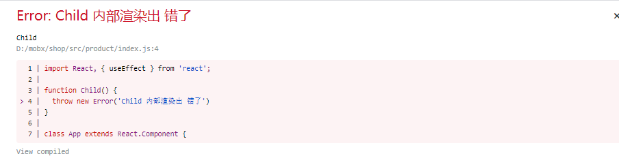
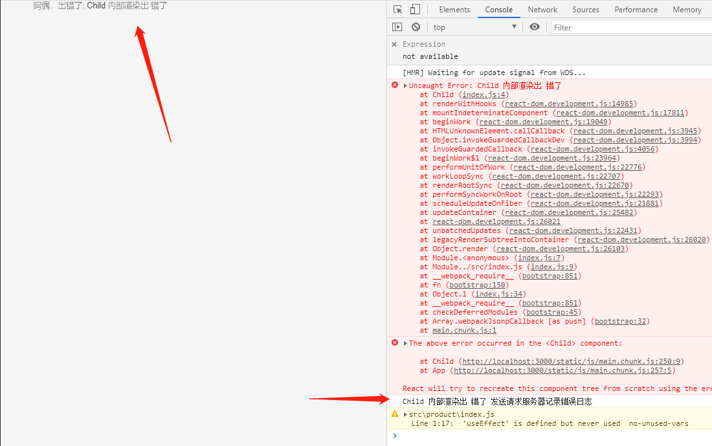

### React 性能优化

核心减少渲染真实DOM的频率,减少Diff比对次数

#### 1. 组件卸载前做清理操作

组建中注册的事件计时器等在组件卸载时做清理操作

#### 2. 使用纯组件降低组件重新渲染的频率

纯组件指在输入相同的state props 时呈现相同的输出

- **PureComponent** 内部通过对当props和state进行浅比较，减少不必要的diff
  ```js
	class Com extends React.PureComponent {
		...
	}
  ```
- 也可以通过生命周期函数 **shouComponentUpdate** 来阻止组件不必要的渲染

#### 3. React.memo

用于函数组件，类似类组件使用的 **PureComponent**

**React.memo** 是一个高阶组件（HOC， 高阶组件用于共享代码，逻辑复用）

```js
const MemoCon = React.memo((props) => {
	return <div>{props.name}</div>
})

// 使用 <MemoCon>时 只要name不变就不会重新渲染
```

**memo** 也可以通过传递第二个参数，来进行深度比较

```js
function Name(props) {
	return <div>{props.obj.name}</div>
}

const MemoCon = React.memo(Name, (preProps, newProps) => {
	if (preProps.name === newProps.name) {
		return true; // 返回 true 代表不用更新
	}

	return false; // 返回false 代表需要更新
})
```

#### 4. shouComponentUpdate 减少组件渲染频率

```js
class Con extends Component {
	shouldComponentUpdate(nextProps, nextState) {
		if (this.state.name !== nextState.name) {
			return true;
		} else return false
	}

	...
}
```

#### 5.懒加载

```react
const {lazy, Suspense} from 'react';

const About = lazy(() => import('./About'));


<BrowserRouter>
	<Switch>
		<Route path="/about">
			<Suspense fallback={<div>loading...</div>}>
				<About/>
			</Suspense>
		</Route>
	</Switch>
</BrowserRouter>
```

#### 6. Fragment 来避免额外的标记

```react
<React.Fragment>
	<div>1</div>
	<div>1</div>
</React.Fragment>

// 或者直接
<>
	<div>1</div>
	<div>1</div>
</>
```

#### 7. 不要使用内联函数定义

在使用内联函数后， **render** 每次运行都会创建函数的新实例,造成性能开销

```react

// 内联函数方式
class Con extends Component {

	render () {
		return <input
			onChange={e => {console.log(e.target.value)}}
		/>
	}
	
}


//推荐这样写
class Con extends Component {

	log = (e) => {
		console.log(e.target.value)
	}

	render () {
		return <input
			onChange={this.log}
		/>
	}
	
}

```

#### 8. 在构造函数中this绑定

通过 **fn(){}** 的形式声明函数时，可以通过在构造函数中绑定 **this** 也可以通过调用的地方绑定 **this**,不过两者的方式也存在区别

在 调用的地方 绑定 **this** 会造成与内联函数一样的问题，每次调用 render 都会生成一个新的函数实例，从而产生性能问题，（并且会影响子组件里的 **componentDidUpdate**失效 ）

而 **constroctor** 中执行会只绑定一次，推荐使用这种用法

```react
// 不推荐
class Con extends Component {
	constructor(props) {}
	
	fn() {}
	
	render() {
		return <button onClick={this.fn.bind(this)}>click</button>
	}
}

// 推荐
class Con extends Component {
	constructor(props) {
        super(props);
        this.fn = this.fn.bind(this);
    }
	
	fn() {}
	
	render() {
		return <button onClick={this.fn}>click</button>
	}
}
```

当然，我们也可以借助箭头函数来书写，这里看下箭头函数编译后的结果

```js
class Con extends Component {
	fn = () => {
		console.log('fn');
	}
	...
}
// 编译后相当于
class Con extends Component {
    constructor(props) {
        super(props)
        this.fn = () => {
            console.log('fn')
        }
    }
}
```


#### 9. 箭头函数使用情景

箭头函数在this指向上有一定优势， 但是也有不利的一面

箭头函数会将函数绑定到实例对象上，添加的是实例对象属性， 而不是原型对象属性，如果组件多次调用，每个组件实例对象上都会有相同的函数实例，会产生一定的性能开销

那么在构造函数中绑定 **this** 不也是实例对象属性吗，没错。上面一点我们也看过箭头函数编译后的代码了。不过这里需要探讨的是，在什么情况下更适合使用箭头函数，什么情况下更适合使用普通函数。

这里举一个栗子, 场景是我们有一个组件，需要从接口获取公司人员的数组，数组中的每一个人包含id，所属领导id等信息，现在在这个组件中需要将数组处理成一个树形的包含关系，在界面上显示一个包含层级关系的公司员工列表。

```react
class Con extends Component {
	constructor(props) {
		super(props);
		this.state = {
			peopletree: []
		}
	}
	componentDidMount() {
		// 模拟从服务器获取到了数据 data， 代表公司的所有人员集合
		const data = [
				{
					belong: null,
					id: '1',
					name: '张三',
					position: '部门总监',
				},
				{
					belong: '1',
					id: '2',
					name: '李四',
					position: '前端leader'
				},
				// ...
			]
		}
    	// 调用实例方法
		this.setPeopleTree(data);
	}
	
	setPeopleTree = (list) => {
        // 使用原型属性方法拿到结果
		const peopletree = this.reduceListToTreeList(list);
        this.setState({
            peopletree
        })
	}
	
	reduceListToTreeList(list) {
        //处理逻辑 省略
		// 这里直接模拟返回处理完成的结果
		return [{
            {
                belong: null,
                id: '1',
                name: '张三',
                position: '部门总监',
            	under: [
            		{
            			belong: '1',
                         id: '2',
                         name: '李四',
                         position: '前端leader',
            			under: [...]
        			}
            	]
            },
        }]
	}
    
    render() {
        ... // 渲染界面
    }
}
```

这个栗子中，通过 处理列表返回树的方法 **reduceListToTreeList** 由于内部不需要使用 **this**， 通过普通函数声明方式将其挂载到组件原型属性上，不必在每个实例声明相同逻辑的函数，减少一定的性能开销

所以，在类组件里的某些不使用this的函数中，可以使用普通函数的声明方法挂载到原型对象属性上。（ps: 当然了，如果有需要也可以把原型属性方法提取到工具类里使用）

#### 10. 避免使用内联样式属性


内联样式会被编译成js代码，然后映射上元素上。需要额外执行js脚本，需要浪费一些性能。

另外，通过内联样式也会导致组件每次render都会实例化一个样式对象，产生一定的开销。如果一定要使用内联js样式，尽量提取样式对象到外层吧。

推荐使用引入 **css** 文件的方式。

ps：这里再提一种非常少见也是错误使用的方法，比如在调用一个 **memo** 优化后的组件，给这个组件传递了 **style** （react是不允许使用style作为属性传递的，如果在组件内部获取 **props.style** 会报错。但是如果内部没有这么做，仅仅是父组件在调用 **memo** 优化的组件时传递了 内联 **style** 是不会报错的），那么每次父组件**render** ， 子组件都会**render**。 

通过这点只是为了提示大家在**render**中尽量不要动态的声明对象、函数。因为

- 每次都要声明新的对象，之前的对象浏览器又要额外做垃圾回收。
- 会导致接收对象参数的 纯组件 无谓的渲染

#### 11. 优化条件渲染

频繁的挂载卸载组建是消耗性能的操作，因此需要减少挂载和卸载次数

在 **React** 中经常通过条件来渲染不同的界面

比如这里我有一个经过memo优化的组件 **MemoFooter** 和一个普通组件 **Header**

```react
function Header () {
	useEffect(() => {
		console.log('header挂载')
		return () => {
			console.log('header卸载');
		}
	})
	return <div>header</div>
}

function Footer () {
	useEffect(() => {
		console.log('footer挂载');
		return () => {
			console.log('footer卸载')
		}
	})
	return <div>footer</div>
}

const MemoFooter = React.memo(Footer);
```

然后在 **App** 组件中条件渲染 **Header**

```react
function App () {
	const [staff, setStaff] = useState(false);
	useEffect(() => {
		setTimeout(() => {
			setStaff(true);
		}, 5000)
	}, [])

	if (staff) {
		return <>
			<Header/>
			<MemoFooter/>
		</>
	} else {
		return <>
			<MemoFooter/>
		</>
	}
}
```

在上面的情况中，五秒后会看到控制台打印

```
footer挂载
// 5s 后
footer卸载
header挂载
footer挂载
```

推荐优化条件语句

```react
function App () {
	const [staff, setStaff] = useState(false);
	useEffect(() => {
		setTimeout(() => {
			setStaff(true);
		}, 5000)
	}, [])

	return <>
	 	{ staff && <Header/> }
	 	<MemoFooter/>
	</>
}

```

优化后 控制台打印情况为

```
footer挂载
// 5s后
header挂载
```


#### 12. 不要在render中更改应用程序的状态

**render**中继续使用 更改程序状态，就会发生 **render** 方法无限调用导致程序崩溃

render中

- 不要使用 **setState**
- 不要通过其他手段查询更改原生 **DOM** 元素


#### 13. 为组件创建错误边界

默认情况下组件错误会导致整个应用程序中断，创建错误便捷确保在特定组建发生错误时程序不会中断

错误边界可以捕获子组件在渲染时发生的错误，当错误发生时，将错误记录下来，并可以显示备用UI界面

错误边界涉及两个生命周期函数

- getDerivedStateFromError， 静态方法，返回一个对象，该对象会和state进行合并，用于更改应用程序状态 
- componentDidCatch，用于记录应用程序错误信息，该方法的参数就是错误对象

```react
function Child() {
	throw new Error('Child 内部渲染出 错了')
}

class App extends React.Component {
	constructor(props) {
		super(props);
		this.state ={
			error: false
		}
	}
	componentDidCatch(e) {
		console.log(e.message, '发送请求服务器记录错误日志')
	}
	static getDerivedStateFromError(e) {
		return {
			error: e
		}
	}
	render() {
		const {error} = this.state;
		return error ? <>阿偶，出错了: {error.message}</> : <Child/> 
	}
}
```

当**App**组件渲染后，由于**Child**内部错误，**App**中会捕获到**Child**中的异常，调用 **componentDidCatch** 中的方法，并渲染错误替代界面。

由于是开发模式并使用了**create-react-app**，会看到这个界面，




生产环境下，可以直接看到替代界面




#### 14. 避免数据结构突变

```react
this.state = {
	name: 'along',
	age: 12,
}

render () {
	return <div>
		{this.state.name}
		{this.state.age}
	</div>
}

```

#### 15. 为列表数据添加唯一标识key

添加唯一标识来优化遍历节点的**diff**性能,这有利于**react**内部优化

#### 16. 节流和防抖

节流限制频率，防抖限制连续


react中的一些场景如果没有进行节流防抖会导致多次的无效的render

节流
- 下拉加载

```js
function throttle(fn, time) {
	let canRun = true;
	return function () {
		if (!canRun) return;
		canRun = false;
		
		setTimeout(() => {
            fn.apply(this, ...arguments);
			canRun = true;
		}, time)
	}
}
```


防抖， 只在一段操作的最后执行操作

- 关键字提示
- wendow.onResize, 

```js
function debounce (fn, time) {
	let timer = null;
	return function () {
		clearInterval(timer);
		setTimeout(fn, time);
	}
}
```

#### 17. 外部使用 CDN 加载

内容交付网络 （CDN）, 指得是地理上分散的服务器组，他们提供网络内容的快速交付

好处
- 突破浏览器对同一域下并发请求的数量限制，可以将不同的资源放到不同的CDN中
- 当你向CDN发送请求是，会通过理你最近的数据中心进行相应，减少延迟
- 多个网站引用的相同资源会有缓存，比如之前网站缓存了 **jquery**

#### 18. 依赖优化

项目中以来的第三方包，但是没有使用包中的所有代码，可以通过插件对以来进行优化，比如**antd**的按需引入

#### 19. 长列表优化（虚拟列表）

在渲染大数据量的列表时，如果一层行全部渲染会感到明显的卡顿。

此时我们可以 通过 **可视区渲染** 来提升性能，即只渲染页面可视区域及附近的列表项，在滚动列表时动态更新列表项 

在**react**中可以借助**react-virtualized** 来进行 **可视区渲染**

```js
// 用于渲染每一行的内容
function rowRenderer({
	key,         // // 唯一key，这个是组件帮我们生成的
	index,       // 索引号
	isScrolling, // 当前项是否正在滚动中
	isVisible,   // 当前项在List中是否可见的
	style        // 给每一个行数添加该样式,包含了定位信息
}) {
	return (
		<div
			key={key}
			style={style}
		>
			{list[index]}
		</div>
	)
}

class App extends React.Component {

	
	render() {
		const list = [...]; // 一个大数据列表

		return <List
			// 组件的宽度
			width={300}
			// 组件的高度
			height={50}
			rowCount={list.length}
			// 每行的高度
			rowHeight={20}
			rowRenderer={rowRenderer}
		/>
	}
}
```


